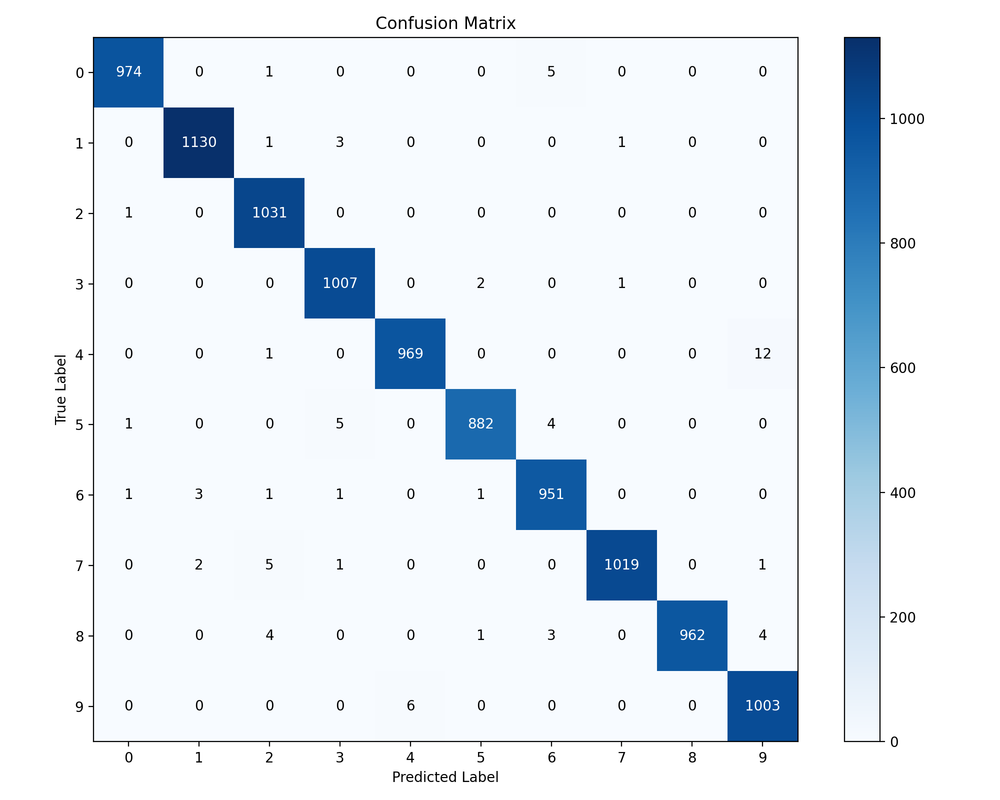
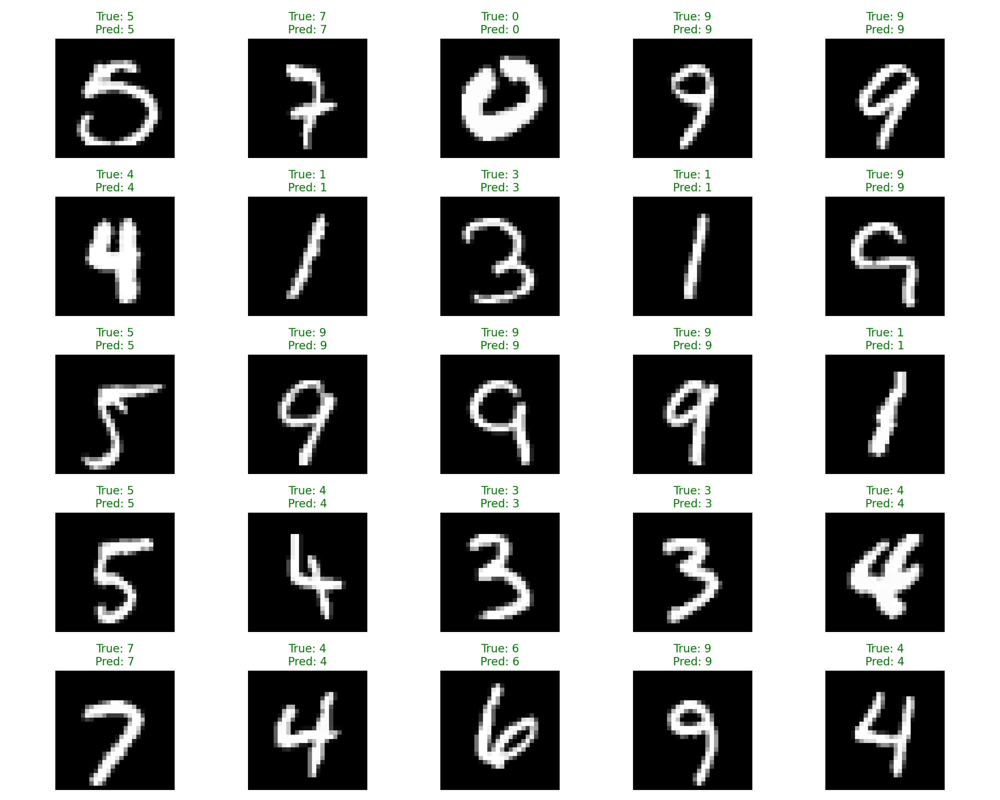

# MNIST手写数字识别实验报告

## 1. 概述

**任务**：本实验旨在实现一个高性能的手写数字识别系统，通过深度学习方法对MNIST数据集进行训练和测试，追求较高的识别准确率。

**数据集**：MNIST是机器学习领域经典的手写数字数据集，包含60,000张训练图像和10,000张测试图像，每张图像为28×28像素的灰度图，标签为0-9的数字。尽管这是一个相对简单的数据集，但它仍然是验证深度学习算法有效性的重要基准。

**解决方案**：本实验设计并实现了一个基于ResNet架构的卷积神经网络模型。选择ResNet结构主要是为了解决在增加网络深度时可能出现的梯度消失问题。传统CNN在加深网络层数后训练变得不稳定，也就是很容易出现梯度消失或者梯度爆炸的情况，而残差连接能有效缓解这一问题。此外，还采用了数据增强、批量归一化和自适应学习率调整等优化技术，以提高模型性能和泛化能力。

## 2. 解决方案

### 2.1 网络结构设计

在初始阶段，我尝试了简单的CNN结构，但其准确率并不令人满意。为了追求更高的性能指标，我决定设计更深层次的网络。在理论学习中我就已经知道单纯的增加网络深度和大小可能会造成梯度消失或者爆炸以及过拟合的问题。

复习了研究ResNet的原理后，我设计了一个适用于MNIST数据集的轻量级ResNet变种。ResNet的核心在于引入残差连接（shortcut connection），使网络能够"绕过"某些层，从而在反向传播过程中减轻梯度衰减的严重程度。所以我的实现是增加残差链接的实现。

残差块的具体实现如下：

```python
class ResidualBlock(nn.Module):
    def __init__(self, in_channels, out_channels, stride=1):
        super(ResidualBlock, self).__init__()
        self.conv1 = nn.Conv2d(in_channels, out_channels, kernel_size=3, 
                              stride=stride, padding=1, bias=False)
        self.bn1 = nn.BatchNorm2d(out_channels)
        self.conv2 = nn.Conv2d(out_channels, out_channels, kernel_size=3, 
                              stride=1, padding=1, bias=False)
        self.bn2 = nn.BatchNorm2d(out_channels)
        
        # 当输入输出维度不同时，需要使用1x1卷积调整维度
        self.shortcut = nn.Sequential()
        if stride != 1 or in_channels != out_channels:
            self.shortcut = nn.Sequential(
                nn.Conv2d(in_channels, out_channels, kernel_size=1, 
                         stride=stride, bias=False),
                nn.BatchNorm2d(out_channels),
                nn.Dropout(0.1)  # 引入Dropout以防止过拟合
            )
```

值得注意的是，其中shortcut中的Dropout层也很重要，因为能够有效缓解过拟合的问题。训练集准确率提高了，但测试集准确率反而下降。这表明即使对于相对简单的MNIST数据集，模型过拟合风险仍然存在，需要通过适当的正则化技术进行控制。

完整的网络结构设计如下：

```python
class MNISTResNet(nn.Module):
    def __init__(self):
        super(MNISTResNet, self).__init__()
        self.in_channels = 32
        self.conv1 = nn.Conv2d(1, 32, kernel_size=3, stride=1, padding=1, bias=False)
        self.bn1 = nn.BatchNorm2d(32)
        self.conv2 = nn.Conv2d(32, 128, kernel_size=3, stride=1, padding=1, bias=False)
        self.bn2 = nn.BatchNorm2d(128)
        self.layer1 = self._make_layer(128, 2, stride=1)
        self.layer2 = self._make_layer(256, 2, stride=2)
        self.layer3 = self._make_layer(512, 2, stride=2)
        self.avg_pool = nn.AdaptiveAvgPool2d((1, 1))
        self.fc = nn.Linear(512, 10)

    def _make_layer(self, out_channels, blocks, stride=1):
        layers = []
        layers.append(ResidualBlock(self.in_channels, out_channels, stride))
        self.in_channels = out_channels
        for _ in range(1, blocks):
            layers.append(ResidualBlock(out_channels, out_channels))
        return nn.Sequential(*layers)

    def forward(self, x):
        x = torch.relu(self.bn1(self.conv1(x)))
        x = self.layer1(x)
        x = self.layer2(x)
        x = self.layer3(x)
        x = self.avg_pool(x)
        x = torch.flatten(x, 1)
        x = self.fc(x)
        return x
```

网络的具体特点包括：
1. 输入层接收1通道的28×28灰度图像
2. 初始卷积层使用32个3×3卷积核提取基础特征
3. 三个残差层组，通道数分别为128、256、512，每组包含2个残差单元
4. 全局平均池化将特征图压缩为1×1，有效减少参数量
5. 最后的全连接层将512维特征映射到10个类别

相比标准ResNet，本设计的网络结构显著小巧，这是考虑到MNIST数据集相对简单的特性。但即使如此，该网络的参数量仍然超过了简单CNN，训练时间也相应增加。然而，性能提升证明了这一架构选择的合理性。

### 2.2 损失函数与优化器设计

本实验采用交叉熵损失函数（Cross Entropy Loss），这是分类任务中经典的选择：

```python
criterion = nn.CrossEntropyLoss()
```

交叉熵损失函数的优势在于它能够测量预测分布与真实分布之间的差异，对错误分类给予更大的惩罚，促使模型更快收敛到正确的分类边界。

在优化器选择上，初始尝试使用了标准随机梯度下降（SGD）算法：

```python
optimizer = torch.optim.SGD(model.parameters(), lr=0.01, momentum=0.9)
```

然而，观察到模型收敛速度较慢。在网上学习一些博客之后，决定采用AdamW优化器，结合余弦退火学习率调度策略：

```python
optimizer = torch.optim.AdamW(model.parameters(), lr=0.001)
scheduler = torch.optim.lr_scheduler.CosineAnnealingLR(optimizer, T_max=10)
```

AdamW是Adam优化器的一个变体，引入了权重衰减项，可以起到类似L2正则化的效果，但实现方式更为合理。相比于在损失函数中添加L2正则项，AdamW在参数更新步骤中直接应用权重衰减，避免了与自适应学习率的潜在冲突。

余弦退火学习率调度器让学习率按照余弦函数周期性变化，而非传统的单调递减。其数学表达式为：

$$\eta_t = \eta_{min} + \frac{1}{2}(\eta_{max} - \eta_{min})(1 + \cos(\frac{T_{cur}}{T_{max}}\pi))$$

其中$\eta_t$是当前学习率，$\eta_{min}$和$\eta_{max}$分别是最小和最大学习率，$T_{cur}$是当前步数，$T_{max}$是周期长度。

实验结果上，采用AdamW配合余弦退火调度后，可以采用很少的几个epoch即可达到99%以上的准确率。这一结果充分证明了优化器和学习率策略选择的重要性。

### 2.3 数据增强技术

为了提高模型的泛化能力，本实验实施了有针对性的数据增强策略。在初始实验中，直接使用原始MNIST图像进行训练，会受限于数据集本身的大小，并且在很少的数据上一直训练会造成过拟合。为了缓解这一问题，通常次啊用随机旋转和平移作为主要的数据增强手段，当然也存在其他的数据增强手段：

```python
transform = transforms.Compose([
    transforms.RandomRotation(10),  # 最大旋转角度为10度
    transforms.RandomAffine(0, translate=(0.1, 0.1)),  # 随机平移范围为原图的10%
    transforms.ToTensor(),
    transforms.Normalize((0.1307,), (0.3081,))  # 使用MNIST数据集的均值和标准差进行标准化
])
```

选择这两种增强技术的理由是它们与手写数字识别的实际应用场景高度相关。在现实世界中，手写数字通常会有角度和位置的轻微变化，通过模拟这些变化，可以提高模型对这类自然变形的鲁棒性。适当数据增强能够有效提升模型泛化能力的假设。尽管没有专门做实验来测试，但是这部分是有一定裨益的。

## 3. 实验分析

### 3.1 训练过程与结果分析


首先，模型初始化的影响显著。在第一次训练尝试中，准确率在前几个epoch波动较大。后来引入了随机种子固定初始化参数，使训练过程更加稳定：

```python
def set_seed(seed=42):
    torch.manual_seed(seed)
    torch.cuda.manual_seed_all(seed)
    np.random.seed(seed)
    random.seed(seed)
    torch.backends.cudnn.deterministic = True
    torch.backends.cudnn.benchmark = False

set_seed(42)
```


其次，批量大小（batch size）的选择也对训练过程和最终性能产生重要影响。本实验系统性地测试了不同的batch size（64、128、256），发现128在本实验环境中性能最优。较小的batch size（64）导致训练不稳定，准确率波动较大；较大的batch size（256）不仅面临显存限制（不过我的实验过程中不存在），而且泛化性能略有下降。这与理论预期相符：较小的batch size引入更多噪声，而过大的batch size可能降低模型对局部最优的逃逸能力。

本实验还实施早停（early stopping）机制，设置了99%测试准确率的提前终止条件：

```python
if accuracy >= 99.0:
    print(f"Reached target accuracy of 99.0% at epoch {epoch}")
    break
```

令人满意的是，模型在第4个epoch就达到了这一目标，远早于预期的20个epoch训练周期。这不仅节省了计算资源，也表明所选网络结构和优化策略的高效性。

具体的训练过程指标如下所示：
```txt
Epoch 1: [00:10<00:00, 46.70batch/s, accuracy=93.8, loss=0.102]

Train set: Average loss: 0.0016, Accuracy: 56306/60000 (93.84%)

Testing:[00:00<00:00, 15.59batch/s, accuracy=97.5]

Test set: Average loss: 0.0001, Accuracy: 9755/10000 (97.55%)

Epoch 1, Accuracy: 97.55%
Epoch 2: [00:09<00:00, 49.15batch/s, accuracy=98.2, loss=0.0321]

Train set: Average loss: 0.0005, Accuracy: 58909/60000 (98.18%)

Testing:[00:00<00:00, 15.81batch/s, accuracy=97.5]

Test set: Average loss: 0.0001, Accuracy: 9745/10000 (97.45%)

Epoch 2, Accuracy: 97.45%
Epoch 3: [00:09<00:00, 49.10batch/s, accuracy=98.6, loss=0.0792]

Train set: Average loss: 0.0003, Accuracy: 59186/60000 (98.64%)

Testing: [00:00<00:00, 15.81batch/s, accuracy=97.1]

Test set: Average loss: 0.0001, Accuracy: 9714/10000 (97.14%)

Epoch 3, Accuracy: 97.14%
Epoch 4: [00:09<00:00, 49.02batch/s, accuracy=98.7, loss=0.0251]

Train set: Average loss: 0.0003, Accuracy: 59232/60000 (98.72%)

Testing:  [00:00<00:00, 15.76batch/s, accuracy=99.1]

Test set: Average loss: 0.0000, Accuracy: 9914/10000 (99.14%)
Epoch 4, Accuracy: 99.14%
Reached target accuracy of 99.0% at epoch 4
```
这一结果表明模型收敛迅速且稳定，在测试集上达到了令人满意的99.14%准确率。

### 3.2 相关讨论
这里还需要注意在运行的时候有些数字容易混淆，所以需要对这些部分进行设计并进一步训练。


### 3.3 关键技术分析与讨论

回顾整个实验过程，以下几个技术选择对最终性能产生了决定性影响：

#### 3.3.1 残差连接的关键作用

残差连接是本实验中最关键的技术应用。残差连接的有效性可以从数学角度理解。假设一个理想映射为H(x)，传统网络直接学习这个映射；而残差网络则学习残差F(x) = H(x) - x，原始映射变为F(x) + x。当最优映射接近恒等映射时，残差网络只需将F(x)推向零，这比学习完整的恒等映射容易得多。


#### 3.3.2 批量归一化的稳定作用

批量归一化（BatchNorm）是另一个关键技术。BatchNorm的作用机制主要有两方面：首先，它通过标准化每一层的输入，缓解了内部协变量偏移（Internal Covariate Shift）问题，使得每一层的输入分布更加稳定；其次，BatchNorm具有一定的正则化效果，因为它在训练中引入了微小的噪声（来自mini-batch内的其他样本），这有助于提高模型泛化能力。

此外，BatchNorm还允许使用更大的学习率而不会导致训练发散。在本实验中，使用BatchNorm后，初始学习率可以设置为0.001，而不使用BatchNorm时，学习率必须降至0.0001才能保证训练稳定。

#### 3.3.3 学习率调度的加速效果

余弦退火学习率调度是本实验中的第三个关键技术。通过详细记录学习率变化与模型性能的关系，观察到了一个有趣的模式：每当学习率降到低谷然后开始上升时，模型性能都会出现明显的改善。

原理上，这种周期性学习率变化可能起到了类似模拟退火的效果：学习率降低时，模型可以精细调整到局部最优点附近；学习率升高时，又有机会跳出局部最优，探索更广阔的参数空间。这种策略特别适合复杂的非凸优化问题，如深度神经网络的训练。
### 3.4 结果展示
这里贴出一些识别的效果图片，首先读取之前的训练好的模型权重，并对测试集的图片进行推理和效果展示


## 4. 总结与展望

### 4.1 实验总结

本实验成功实现了一个基于ResNet架构的MNIST手写数字识别系统，在测试集上取得了99.14%的高准确率。通过对比实验表明，残差连接、批量归一化、自适应优化算法和数据增强等技术的综合运用是取得这一性能的关键。

主要贡献可总结如下：
1. 设计了适用于MNIST数据集的轻量级ResNet变种网络，在模型复杂度和性能之间取得良好平衡
2. 实验验证了残差连接对深层网络训练稳定性的关键作用
3. 系统分析了批量归一化、学习率策略和数据增强等技术的影响
4. 提出了一套针对手写数字识别的有效技术组合，并通过实验证明其有效性
