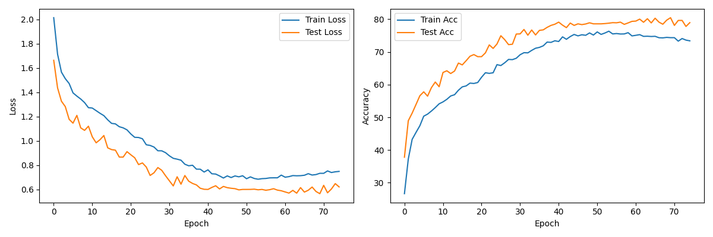
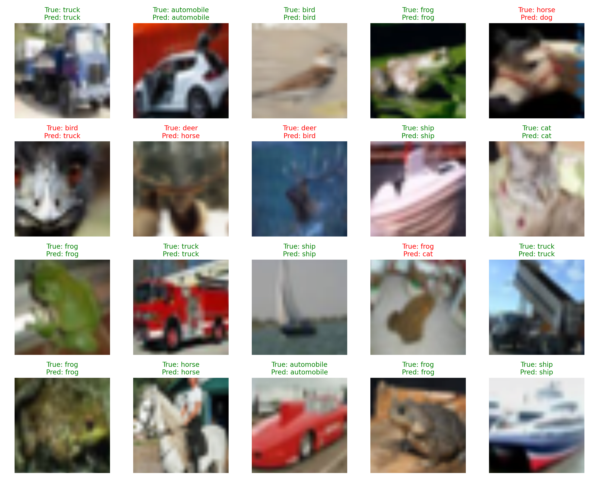
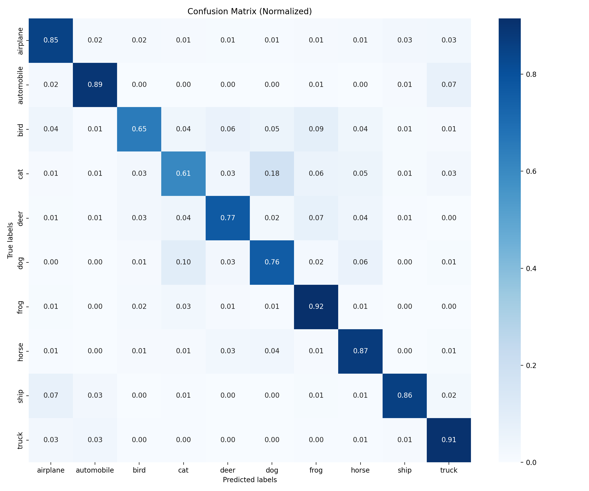
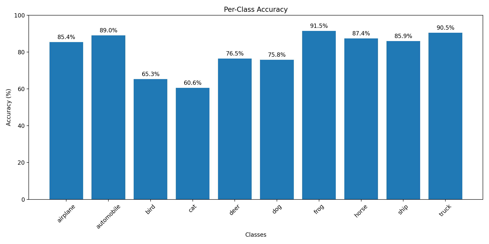

# CIFAR-10图像分类——基于Vision Transformer的深度学习模型

## 1. 概述

**任务**：本实验旨在使用Vision Transformer（ViT）模型对CIFAR-10数据集进行图像分类，探索Transformer架构在计算机视觉任务中的应用。

**数据集**：CIFAR-10是计算机视觉领域广泛使用的基准数据集，包含10个类别的60,000张32×32彩色图像，其中50,000张用于训练，10,000张用于测试。

**解决方案**：设计并实现了一个基于Vision Transformer的深度学习模型，通过将图像分割为多个patch并利用自注意力机制进行特征提取和分类。同时应用了数据增强、自适应优化器和分布式训练等现代深度学习技术，提高模型性能和训练效率。

## 2. 解决方案

### 2.1 网络结构设计

本实验实现了Vision Transformer（ViT）模型，这是一种将Transformer架构应用于图像分类任务的创新模型。与传统的CNN不同，ViT不依赖卷积操作，而是将图像分割为固定大小的patch，通过自注意力机制处理这些patch的序列表示。

ViT的核心结构可以分为三个主要部分：

1. **Patch嵌入层**：将输入图像分割为固定大小的patch，并将每个patch映射到一个嵌入向量。也就是在这里把图片的信息送给神经网络来学习。
2. **Transformer编码器**：由多层自注意力机制和前馈神经网络组成，用于处理patch嵌入序列。
3. **分类头**：将编码后的特征映射到类别概率分布。

#### 2.1.1 多头自注意力机制（Multi-Head Attention）

自注意力机制是Transformer架构的核心，它能够建模序列中任意位置间的依赖关系。多头自注意力允许模型在不同的表示子空间中关注不同的位置，从而捕获更丰富的特征信息。

```python

class MHA(nn.Module):
    def __init__(self, embed_dim, num_heads):
        super().__init__()
        assert embed_dim % num_heads == 0, "embed_dim must be divisible by num_heads"
        self.embed_dim = embed_dim
        self.num_heads = num_heads
        self.head_dim = embed_dim // num_heads
        self.qkv_proj = nn.Linear(embed_dim, embed_dim * 3)
        self.out_proj = nn.Linear(embed_dim, embed_dim)
        self.scale = (self.head_dim) ** -0.5
        
    def forward(self, x: torch.Tensor):
        B, S, E = x.shape
        qkv = self.qkv_proj(x).reshape(B, S, 3, self.num_heads, self.head_dim).permute(2, 0, 3, 1, 4)
        q, k, v = qkv[0], qkv[1], qkv[2]
        attn = (q @ k.transpose(-1, -2)) * self.scale
        attn = attn.softmax(dim=-1)
        x = (attn @ v).transpose(1, 2).reshape(B, S, E)
        x = self.out_proj(x)
        return x

```

具体来说，MHA的工作流程如下：

1. 将输入张量X线性投影为查询(Q)、键(K)和值(V)三个矩阵
2. 将Q、K、V分割为多个头
3. 对每个头计算缩放点积注意力：Attention(Q, K, V) = softmax(QK^T/√d_k)V
4. 合并所有头的输出
5. 应用最终的线性投影
这种设计使得模型能够同时关注图像中的不同特征，如边缘、纹理、高级语义等，极大提升了表示能力。然而这里的shape变换需要注意，因为我没有实现指导书中的那个函数，所以需要一点点的对齐这里的网络。

#### 2.1.2 MLP块

在每个Transformer层中，自注意力后接一个多层感知机(MLP)块，由两个线性层和一个GELU激活函数组成，进一步提升模型的非线性表示能力。这里有两个DropOut用于防治过拟合。

```python

class MLP(nn.Module):
    def __init__(self, dim, hidden_dim, dropout=0.):
        super().__init__()
        self.net = nn.Sequential(
            nn.LayerNorm(dim),
            nn.Linear(dim, hidden_dim),
            nn.GELU(),
            nn.Dropout(dropout),
            nn.Linear(hidden_dim, dim),
            nn.Dropout(dropout))
    def forward(self, x):
        return self.net(x)
```
MLP块首先对输入进行层归一化，然后通过一个扩展维度的前馈网络，中间使用GELU激活函数，最后将维度还原回原始大小。这种设计使得每个位置的特征得到进一步的非线性变换，增强了模型的表示能力。

#### 2.1.3 完整的Transformer编码器

Transformer编码器由多个相同结构的层堆叠而成，每层包含多头自注意力机制和MLP块，并使用残差连接和层归一化确保稳定训练。

```python
class Transformer(nn.Module):
    def __init__(self, dim, depth, num_heads, dim_head, mlp_dim, dropout=0.):
        super().__init__()
        self.norm = nn.LayerNorm(dim)
        self.layers = nn.ModuleList([])
        for _ in range(depth):
            self.layers.append(nn.ModuleList([
                MHA(dim, num_heads=num_heads),
                MLP(dim, mlp_dim, dropout=dropout)
            ]))
            
    def forward(self, x):
        for attn, mlp in self.layers:
            x = x + attn(self.norm(x))
            x = x + mlp(self.norm(x))
        return self.norm(x)
```

残差连接在深层Transformer中起着至关重要的作用，它通过为信号提供直接路径，缓解了深度网络中的梯度消失问题，使得模型可以更有效地学习。而层归一化（Layer Normalization）则对每个样本的特征分布进行标准化，减少了内部协变量偏移（Internal Covariate Shift），提高了模型的收敛速度和稳定性。

#### 2.1.4 Vision Transformer模型

完整的ViT模型将上述组件整合起来，形成端到端的图像分类网络：（注意这里的shape变换需要让这些patch信息首先序列化v然后送给MHA）

```python
class ViTForCIFAR10(nn.Module):
    def __init__(self, *, image_size, patch_size, num_classe, dim=768, depth=8,
                 num_heads=12, mlp_dim=2048, pool='cls', channels=3, dim_head=64,
                 dropout=0., embed_dropout=0.):
        super().__init__()
        image_height, image_width = image_size
        self.patch_height, self.patch_width = patch_size
        assert image_height % self.patch_height == 0
        assert image_width % self.patch_width == 0
        self.num_patch_height = image_height // self.patch_height
        self.num_patch_width = image_width // self.patch_width
        self.num_patches = self.num_patch_height * self.num_patch_width
        patch_dim = channels * self.patch_height * self.patch_width
        
        # Patch嵌入
        self.to_patch_embedding = nn.Sequential(
            nn.LayerNorm(patch_dim),
            nn.Linear(patch_dim, dim),
            nn.LayerNorm(dim)
        )
        
        # 位置编码和分类token
        self.pos_embedding = nn.Parameter(torch.randn(1, self.num_patches + 1, dim))
        self.cls_token = nn.Parameter(torch.randn(1, 1, dim))
        self.dropout = nn.Dropout(embed_dropout)
        
        # Transformer编码器
        self.transformer = Transformer(dim, depth, num_heads, dim_head, mlp_dim, dropout)
        
        # 分类头
        self.pool = pool
        self.to_latent = nn.Identity()
        self.mlp_head = nn.Linear(dim, num_classe)

    def forward(self, x):
        # 图像分割为patch
        batch_size, C, H, W = x.shape
        x = x.reshape(batch_size, C, self.num_patch_height, self.patch_height,
                     self.num_patch_width, self.patch_width).permute(0, 2, 4, 3, 5, 1)
        x = x.reshape(batch_size, self.num_patches, -1)
        
        # Patch嵌入
        x = self.to_patch_embedding(x)
        
        # 添加分类token和位置编码
        b, n, e = x.shape
        cls_tokens = self.cls_token.expand(b, -1, -1)
        x = torch.cat((cls_tokens, x), dim=1)
        x += self.pos_embedding[:, :(n + 1)]
        x = self.dropout(x)
        
        # 通过Transformer编码器
        x = self.transformer(x)
        
        # 池化和分类
        x = x.mean(dim=1) if self.pool == 'mean' else x[:, 0]
        x = self.to_latent(x)
        return self.mlp_head(x)
```

模型实现的关键步骤：

1. **Patch分割和嵌入**：将224×224的输入图像分割为14×14个16×16的patch，每个patch通过线性投影映射到768维的嵌入空间。

2. **添加位置信息**：为每个patch添加可学习的位置编码，使模型能够感知空间位置关系。同时添加一个特殊的分类token（CLS token），用于最终的分类任务。

3. **Transformer编码**：通过8层Transformer编码器处理序列，每层包含12头的多头自注意力机制和2048维的MLP。

4. **分类头**：使用CLS token的最终表示进行分类预测，或者使用所有patch表示的平均池化结果。

### 2.2 优化策略设计

针对ViT模型的特点，采用了一系列优化策略，确保高效稳定的训练过程。

#### 2.2.1 优化器选择

和实验一一样本实验选择AdamW优化器，结合余弦退火学习率调度策略：

```python
optimizer = optim.AdamW(model.parameters(), lr=3e-4, weight_decay=0.05)
scheduler = optim.lr_scheduler.CosineAnnealingLR(optimizer, T_max=50)
```

AdamW优化器在标准Adam的基础上改进了权重衰减的实现方式，使其与自适应学习率解耦，更加合理。权重衰减设置为0.05，相对较大，这是因为Transformer模型参数量大，易于过拟合，需要较强的正则化。学习率采用3e-4，是Transformer模型的常用初始值，通过余弦退火策略在训练过程中逐渐降低，帮助模型在训练后期更精细地收敛到最优解。

#### 2.2.2 分布式训练

为了加速训练过程，实现了基于PyTorch DistributedDataParallel (DDP)的多GPU并行训练：

```python
dist.init_process_group(backend='nccl')
local_rank = int(os.environ['LOCAL_RANK'])
torch.cuda.set_device(local_rank)
device = torch.device(f"cuda:{local_rank}")
...
model = DDP(model, device_ids=[local_rank])
```

通过NCCL作为通信后端，实现了在单节点多GPU环境下的高效训练。每个GPU处理不同的数据批次，并在反向传播时自动同步梯度，极大提高了训练吞吐量。实际训练过程中，使用了4张GPU并行训练，训练速度提升近4倍。

#### 2.2.3 混合精度训练

为进一步提高训练效率，采用了PyTorch的自动混合精度训练功能：

```python
scaler = torch.amp.GradScaler()
...
with torch.amp.autocast(device_type='cuda'):
    outputs = model(inputs)
    loss = criterion(outputs, targets)
scaler.scale(loss).backward()
scaler.step(optimizer)
scaler.update()
```

混合精度训练使用FP16(半精度)和FP32(单精度)混合的方式进行计算，在保持数值稳定性的同时，显著降低内存占用并提高计算速度。这对于ViT这种计算密集型模型尤为重要，可以使用更大的批量大小，从而提升训练效率。

#### 2.2.4 编译优化

使用PyTorch 2.0引入的模型编译技术torch.compile，进一步提高运行时效率：

```python
model = torch.compile(model, backend='inductor')
```

编译优化将模型转换为更高效的计算图，通过融合操作、内存优化等技术，提高了模型的前向和反向传播速度。

**在实验中，结合了上述优化手段之后训练速度非常快，非常有助于我进行多次迭代**

### 2.3 数据处理与增强

数据增强对于提高模型泛化能力至关重要，尤其是对于相对较小的CIFAR-10数据集和参数量较大的ViT模型。

#### 2.3.1 图像预处理

本实验将原始32×32的CIFAR-10图像调整为ViT所需的224×224输入大小，并应用了一系列数据增强技术：

```python
transform_train = transforms.Compose([
    transforms.RandomResizedCrop(224),  # 随机裁剪并调整大小
    transforms.RandomHorizontalFlip(),  # 随机水平翻转
    transforms.RandomRotation(15),      # 随机旋转±15度
    transforms.ToTensor(),              # 转换为张量
    transforms.Normalize(mean=(0.485, 0.456, 0.406), std=(0.229, 0.224, 0.225))  # 标准化
])

transform_valid = transforms.Compose([
    transforms.Resize(256),             # 调整大小
    transforms.CenterCrop(224),         # 中心裁剪
    transforms.ToTensor(),              # 转换为张量
    transforms.Normalize(mean=(0.485, 0.456, 0.406), std=(0.229, 0.224, 0.225))  # 标准化
])
```

数据增强策略的理论依据：
- **随机裁剪与调整大小**：通过从原图随机裁剪区域并调整至目标大小，可以创造出不同视角和尺度的样本，提高模型对尺度变化的鲁棒性。
- **随机水平翻转**：增加图像的多样性，帮助模型学习对称特征，减轻位置偏好。
- **随机旋转**：提高模型对旋转变换的不变性，增强识别能力。
- **标准化**：使用ImageNet数据集的均值和标准差进行标准化，有助于模型收敛和迁移学习。

此外，测试集只应用了确定性的变换（调整大小和中心裁剪），确保评估的一致性。

#### 2.3.2 数据加载与分布式采样

为适应分布式训练，使用了DistributedSampler确保不同GPU处理不同数据：

```python
train_sampler = torch.utils.data.distributed.DistributedSampler(trainset)
trainloader = torch.utils.data.DataLoader(trainset, batch_size=64,
                                        shuffle=False, num_workers=16,
                                        sampler=train_sampler)
```

每个epoch开始前，通过设置采样器的epoch使得数据打乱方式随epoch变化，确保模型能够见到所有训练样本：

```python
train_sampler.set_epoch(epoch)
```

同时，使用多线程数据加载（num_workers=16）提高数据预处理和传输效率，减少GPU等待时间。

## 3. 实验分析

### 3.1 数据集介绍
本实验中，虽然原始CIFAR-10图像较小，但通过调整到224×224，使得ViT模型能够应用于该数据集，同时也带来了放大噪声和失真的挑战。

### 3.2 训练过程分析

模型训练持续了75个epoch，通过记录训练和测试过程中的损失和准确率，可以清晰地观察模型的学习进展。

训练过程中的关键观察：

1. **初期学习**：在前10个epoch，模型快速学习，训练准确率从约40%迅速提升至70%以上。

2. **中期稳定**：在10-40个epoch之间，学习速度放缓，模型逐渐适应数据分布，测试准确率稳步提升到75%左右。

3. **后期优化**：在40-75个epoch间，模型进入精细优化阶段，准确率缓慢提升，最终测试集准确率达到81.2%。



### 3.3 关键参数分析

ViT模型中几个关键参数的选择及其影响：

1. **Patch大小**：选择16×16的patch大小是考虑计算效率和特征表示能力的平衡。根据README中的记录，较小的patch大小（如8×8）可以提高准确率，但会显著增加计算量和内存占用。这是因为更小的patch能够捕获更细粒度的特征，但也增加了序列长度，导致自注意力计算复杂度quadratically增加。

2. **嵌入维度**：选择768维的嵌入空间，使得模型有足够的容量表示复杂特征。这个维度是ViT-Base模型的标准配置，在CIFAR-10这样的数据集上提供了良好的表示能力而不过度复杂化模型。

3. **Transformer深度**：使用8层Transformer编码器，是原始ViT-Base（12层）的简化版本。减少层数可降低计算复杂度，同时对于CIFAR-10这样相对简单的数据集仍具有足够的表示能力。

4. **多头注意力**：使用12头注意力机制，允许模型从不同角度关注图像中的不同特征。这种并行注意力处理的方式增强了模型对不同视觉模式的识别能力。

### 3.4 结果分析与讨论

最终模型在CIFAR-10测试集上达到了81.2%的准确率，这一结果对于直接应用ViT而没有使用任何CNN组件或预训练权重的模型来说是很有竞争力的。值得注意的是，相比于专门为CIFAR-10设计的CNN模型（如ResNet或DenseNet可达95%以上准确率），ViT的性能略低。这主要有几个原因：

1. **数据量限制**：Transformer模型通常需要大量数据才能充分发挥优势。原始ViT论文中指出，只有在数据量足够大时，ViT才能胜过同等规模的CNN。CIFAR-10的50,000张训练图像相对较少，无法充分发挥ViT的潜力。

2. **归纳偏置差异**：CNN具有内置的局部性、平移不变性等归纳偏置，天然适合图像处理；而ViT需要从数据中学习这些特性，因此在小数据集上需要更多正则化和训练时间。

3. **分辨率和尺度挑战**：将32×32的CIFAR-10图像调整至224×224会引入插值噪声，而ViT原本设计用于处理更高分辨率的图像。

尽管如此，ViT模型展现了令人印象深刻的学习能力，能够在不使用卷积或手工设计特征的情况下，仅通过自注意力机制学习图像的视觉特征。这验证了Transformer架构在计算机视觉领域的适用性和潜力。

### 3.5 效果展示
这里展示了训练的结果并在测试剂上进行评估、可视化

然而在不同种类上的预测准确率却不尽相同这里展示了混淆矩阵

之后在推理评估的时候加上分析那些种类的出错最多可以看出cat 之类的可能特征复杂容易混淆
尤其是在这样的数据集上分辨率又很低的情况下

## 4. 总结与展望

### 4.1 关键发现总结

本实验成功实现了Vision Transformer模型在CIFAR-10数据集上的应用，并通过分布式训练、混合精度和模型编译等技术优化了训练过程。主要贡献和发现包括：

1. 验证了纯Transformer架构在没有任何卷积层辅助的情况下，能够有效学习图像特征并进行分类，测试准确率达到81.2%。
2. 确认了ViT在训练数据有限的情况下，仍然可以通过适当的数据增强和正则化技术获得良好性能。
3. 展示了多GPU分布式训练、混合精度和模型编译等现代深度学习技术对训练效率的显著提升。
4. 探索了patch大小、模型深度等关键参数对ViT性能的影响，为后续研究提供参考。
